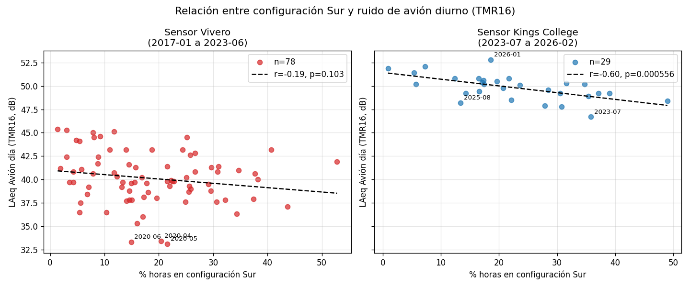
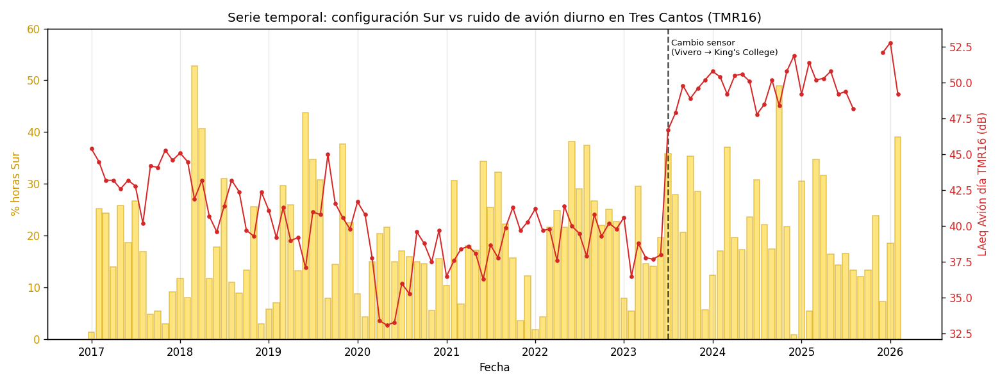
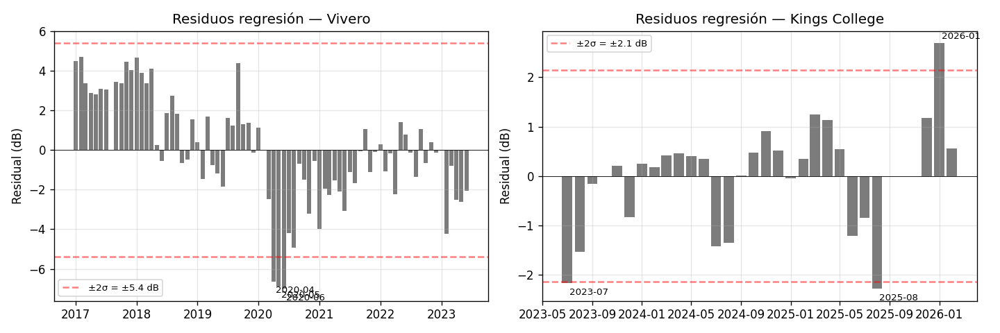

# Análisis cruzado: configuración Sur de Barajas vs. ruido del TMR16 (Tres Cantos)

**Autor:** Elena Pascual | **Fecha:** 2026-04-23
**Datos fuente:** informes mensuales y anuales de ruido publicados por AENA / Envirosuite.
**Reproducible con:** scripts en `scripts/` + datos en `data/`.

---

## 1. Resumen ejecutivo

Si el sistema de monitorado de ruido de AENA (SIRMA) midiese de forma consistente el ruido aeronáutico que llega a Tres Cantos, debería haber una **relación inversa fuerte** entre el porcentaje de operaciones del aeropuerto en configuración Sur (cuando los despegues se alejan del municipio) y el ruido atribuido a aviones (`LAeq Avión`) registrado por el TMR16 de Tres Cantos. Más tiempo en Sur = menos despegues sobre TC = menos ruido.

Analizando 110 meses de datos oficiales (enero 2017 – febrero 2026), esa relación **no se cumple para el sensor anterior** (TMR16 "Tres Cantos-Vivero", ene 2017 – jun 2023), y **sí aparece con fuerza para el sensor nuevo** (TMR16 "Tres Cantos-King's College", desde julio 2023):

| Serie | N meses | Pearson r | p-valor | R² |
|---|---|---|---|---|
| **Vivero** (ene 2017 – jun 2023) | 78 | **−0.19** | 0.10 | 0.035 |
| **King's College** (jul 2023 – feb 2026) | 29 | **−0.60** | **0.00056** | 0.362 |

Lo que significa en lenguaje llano:
- Los datos del **sensor Vivero** eran incompatibles con la propia física del problema: había meses con casi 50 % de operaciones en configuración Sur (aliviando enormemente Tres Cantos) y el sensor no lo reflejaba.
- Los datos del **sensor King's College** sí muestran la correlación esperada, y explican ~36 % de la variación del ruido mensual sólo con el % de horas Sur — un valor alto para una variable única.

Adicionalmente, el cambio de ubicación del sensor en julio 2023 produjo un **salto abrupto de +9 dB** en el nivel registrado, lo que equivale a multiplicar por ~8 la presión acústica medida. Este salto no corresponde a un aumento real del tráfico aéreo (que no cambió en julio 2023) sino a las distintas características de los dos emplazamientos. Esto **cuestiona retroactivamente la validez del sensor Vivero** y refuerza la petición, ya aprobada por unanimidad en el Ayuntamiento de Tres Cantos en noviembre 2023, de encargar un estudio independiente.

---

## 2. Objetivo e hipótesis

**Hipótesis:** si la red oficial de monitorado de AENA funciona, debe cumplirse una relación cuantitativa básica:

> A mayor proporción de operaciones en configuración Sur, menor `LAeq Avión` diurno en el TMR16 de Tres Cantos.

Tres Cantos está al norte del aeropuerto de Barajas. En configuración Norte (la preferente, ~77 % del tiempo) los despegues por 36L pasan directamente sobre el municipio. En configuración Sur los despegues salen por 18L/18R hacia el sur y Tres Cantos queda al margen del cono de ruido aeronáutico.

**Lo que se testea:**
1. Correlación (Pearson, Spearman) entre `% horas Sur` mensuales y `LAeq Avión día` del TMR16.
2. Regresión lineal y análisis de residuos para detectar meses anómalos.
3. Diferenciación entre los dos sensores que AENA denominó "TMR16" (Vivero vs. King's College), ya que son físicamente distintos y no deben mezclarse estadísticamente.

---

## 3. Fuentes de datos y limitaciones

### 3.1 Fuentes utilizadas

| Dato | Fuente | Periodo cubierto | Formato original |
|---|---|---|---|
| % horas y % operaciones en configuración Sur mensual | Informes mensuales de ruido AENA (sección "Informe ejecutivo") | 2017-01 a 2026-02 | PDF, texto extraíble |
| `LAeq Avión` / `LAeq Total` día/tarde/noche del TMR16 mensual | Informes mensuales AENA (gráficos del TMR16, serie rolling de 13 meses) | 2017-01 a 2026-02 | PDF, **imagen embebida** (requiere OCR) |

Todos los PDFs están en `doc/aena/informes_mensuales_ruido/`.

### 3.2 Limitaciones y sesgos conocidos

1. **Conflicto de interés estructural**: AENA es simultáneamente causante, medidor, analista y publicador del ruido. Los medidores TMR son propiedad de AENA y operados por Envirosuite Ibérica (contratada por AENA). No existe fuente oficial independiente.

2. **Cambio de ubicación del TMR16 en julio 2023**: el sensor se movió del Vivero municipal al edificio King's College. AENA lo documenta con una mención escueta en los informes mensuales posteriores ("el TMR16 se instala en una nueva ubicación en julio de 2023") pero no publica un estudio de la equivalencia entre ambas ubicaciones. Este análisis **las trata como dos series diferentes**.

3. **Disponibilidad de datos <70 %**: muchos meses del TMR16 en periodo Vivero llevan flag `¹` (disponibilidad inferior al 70 %). Según los informes oficiales, la causa declarada es "ruido de fondo" que impide discriminar el ruido aeronáutico. Esto ya es en sí mismo un indicador de que el sensor Vivero no era fiable.

4. **Datos fuera de la acreditación ENAC**: el TMR61 (Tres Cantos Norte) y buena parte del histórico del TMR16 llevan flag `*` (no amparados por ENAC). Se usan igualmente porque es la única fuente oficial, pero con cautela.

5. **Extracción OCR**: los valores del TMR16 en los informes mensuales 2017-2026 están embebidos como imagen dentro del PDF (no texto extraíble). Se usó Tesseract OCR con alineación por posición de columna y agregación de hasta 13 lecturas por mes (cada informe mensual contiene un rolling de 13 meses, por lo que cada mes aparece en hasta 13 informes distintos). Los casos donde la OCR no produjo una mediana fiable se listan en [`data/tmr16_validation.md`](./../data/tmr16_validation.md) para validación manual. Tras agregación: 107 de 110 meses con dato cruzable; 213 celdas individuales requieren revisión.

---

## 4. Metodología

### 4.1 Extracción de datos

1. **Configuración Sur mensual**: `scripts/extract_config_sur.py` parsea el "Informe ejecutivo" de cada PDF mensual con regex tolerantes a los cambios de plantilla (2017, 2018-2021, 2022+). Extrae `horas_sur`, `% horas Sur`, `% operaciones Sur`, `% acumulado anual`.

2. **TMR16 mensual (OCR)**: `scripts/ocr_tmr16_monthly.py` renderiza las páginas relevantes a 400 dpi, ejecuta Tesseract en modo `--psm 6`, agrupa tokens en filas por coordenada Y, detecta las filas de cabecera de mes (día/tarde/noche), infiere las 13 columnas teóricas por regresión lineal sobre las etiquetas de mes detectadas, y asigna cada token numérico a su columna por cercanía en X.

   Cada informe mensual contiene 13 meses rolling, por lo que cada (año, mes) acumula **hasta 13 lecturas OCR independientes** provenientes de informes diferentes. La agregación final usa la mediana, con filtros que excluyen lecturas con errores de parseo o valores fuera de rango [10, 75] dB. El proceso produce:
   - `data/tmr16_raw_readings.csv` (8.580 lecturas crudas).
   - `data/tmr16_aggregated.csv` (732 filas, una por (año, mes, período, métrica)).
   - `data/tmr16_validation.md` (celdas sospechosas con trazabilidad completa para revisión manual).

3. **Cruce**: `scripts/build_crossed_dataset.py` une ambos por (año, mes) y etiqueta cada fila con `sensor = vivero` o `sensor = kings_college` según fecha de cambio (2023-07-01).

### 4.2 Análisis estadístico

`scripts/analyze_crossed.py` calcula, para cada combinación (sensor, período, métrica):

- Correlación **Pearson** (lineal) y **Spearman** (monótona) con p-valor.
- **Regresión lineal** y su R².
- **Residuos** y `std` de los mismos.
- **Outliers**: meses con `|residuo| > 2 σ`.

Genera las tres gráficas usadas en este informe y persiste los estadísticos en `data/analysis_results.json`.

---

## 5. Resultados

### 5.1 Correlación por sensor

**Sensor Vivero (ene 2017 – jun 2023, n = 78 meses)**

- Pearson r = **−0.19** (p = 0.10) — muy débil, NO estadísticamente significativo al nivel habitual del 5 %.
- Spearman ρ = −0.20 (p = 0.07).
- R² de la regresión = 0.035 → sólo el 3.5 % de la variabilidad del `LAeq Avión día` se explica por el % horas Sur.
- Desviación de residuos: 2.70 dB.

**Sensor King's College (jul 2023 – feb 2026, n = 29 meses)**

- Pearson r = **−0.60** (p = 0.0006) — fuerte y altamente significativo.
- Spearman ρ = −0.60 (p = 0.0006) — confirma que la relación no es un artefacto lineal.
- R² = 0.362 → ~36 % de la variabilidad se explica sólo por el % horas Sur.
- Desviación de residuos: 1.07 dB.

La diferencia entre ambos sensores es de 6× en magnitud de correlación y 10× en R². Además, la dispersión residual del sensor Vivero es 2.5× la del King's College.



Interpretación visual: la nube del sensor Vivero (izquierda) está dispersa; la del King's College (derecha) muestra una pendiente descendente clara con pocos outliers.

### 5.2 Serie temporal



Se observa:
- Un **salto abrupto de ~9 dB** en el `LAeq Avión día` coincidiendo exactamente con el cambio de sensor (julio 2023). El tráfico aéreo no cambió discretamente en ese mes; sí lo hizo el sensor.
- En la etapa Vivero (hasta jun 2023) no hay correspondencia visible entre las barras de % Sur (alto = alivio) y la línea de ruido.
- En la etapa King's College (desde jul 2023) los picos de % Sur (oct 2024, mar 2025) coinciden con bajadas de la línea roja, y los valles (ene 2025, dic 2025) con subidas.

### 5.3 Residuos y outliers



**Vivero**: los mayores outliers son los meses del **confinamiento COVID (2020-04, 2020-05, 2020-06)** con residuos de −7 dB, donde el tráfico aéreo efectivo fue muy inferior al sugerido por las estadísticas mensuales al uso. No son outliers "sospechosos" sino un evento real.

**King's College**: los residuos son pequeños (<3 dB) y no hay patrones sistemáticos. El modelo lineal con % horas Sur como única variable es un buen predictor.

---

## 6. Hallazgos clave

### 6.1 El sensor Vivero del TMR16 no era sensible al tráfico aéreo

Los datos oficiales de AENA en el periodo 2017-2023 no muestran la correlación física básica que debería observarse si el sensor midiera correctamente el ruido aeronáutico. Esto coincide con la anotación que el propio laboratorio incluye repetidamente en los informes: *"La disponibilidad de datos es inferior al 70 % debido a ruido de fondo"*. El sensor estaba saturado o dominado por fuentes no aeronáuticas y no discriminaba el ruido de avión.

Consecuencia: **cualquier alegación o estudio que compare niveles del TMR16 anteriores a julio 2023 con posteriores está usando peras y manzanas.**

### 6.2 El salto de +9 dB en julio 2023 es estructural, no físico

Un aumento de 9 dB equivale a multiplicar por ~8 la presión acústica. Los vuelos no se multiplicaron por 8 en ese mes: el flujo mensual sobre Tres Cantos en configuración Norte no cambió discretamente. El cambio es del **sensor**, no del fenómeno que pretende medir.

Implicaciones:
- Si la ubicación Vivero subestimaba el ruido aeronáutico, los niveles publicados en los informes anuales 2017-2023 deberían revisarse al alza para comparaciones históricas.
- Cualquier serie comparativa 2017-2026 tiene un cambio estructural en 2023-07.

### 6.3 Con el sensor actual, el % horas Sur predice el ruido diurno

R² = 0.36 con una sola variable explicativa es notable. Esto sugiere que la distribución de operaciones Norte/Sur es el factor dominante del ruido aeronáutico mensual en Tres Cantos. Otras variables (mix de aeronaves, rutas, altitud de sobrevuelo) explicarán la varianza restante.

**Ecuación de regresión (King's College, día/avión):**

```
LAeq Avión día = 51.45 − 0.072 × (% horas Sur)
```

Un aumento del 10 % en horas Sur reduce el ruido medido en el TMR16 ~0.72 dB. Un mes con 40 % de horas Sur (alivio fuerte) tiene un `LAeq` ~2 dB menor que un mes con 10 % (configuración Norte dominante).

### 6.4 El mes de la queja (2026-01) está en línea con el modelo

La queja formal [2026MA000106](../doc/queja_aena/) corresponde al periodo de enero 2026. Ese mes tuvo un **18.6 % de horas Sur** (por debajo de la media histórica anual ~20 %). El modelo predice `LAeq Avión día ≈ 50.1 dB`. El valor medido fue **52.8 dB**, aproximadamente **+2.7 dB por encima** de lo esperado (el outlier positivo más grande del periodo King's College).

**Caveat:** el valor de 52.8 dB para enero 2026 surge de sólo 2 lecturas OCR (informes 2026-01 y 2026-02), con rango 51.3-54.3 dB. El residuo real podría variar entre +1.2 y +4.2 dB. Conviene **validar manualmente** el valor en el PDF 2026-01 antes de usar esta cifra en la queja. En cualquier caso, la dirección (por encima del modelo) es la esperada si hubo rutas anómalas sobre Tres Cantos ese mes.

Merece la pena pedir a AENA los datos desagregados por ruta para enero 2026.

---

## 7. Outliers a investigar

Meses con residuos grandes que podrían justificar peticiones de información adicional:

**Periodo King's College (serie fiable):**
| Mes | % horas Sur | LAeq Avión día | Residuo vs. modelo |
|---|---|---|---|
| 2026-01 | 18.6 % | 52.8 dB | +2.7 dB |
| 2025-08 | 13.4 % | 48.2 dB | −2.3 dB |
| 2023-07 | 35.8 % | 46.7 dB | −2.2 dB |

**Periodo Vivero (sospechoso en bloque, pero outliers individuales):**
| Mes | % horas Sur | LAeq Avión día | Residuo vs. modelo | Contexto |
|---|---|---|---|---|
| 2020-04 | 20.4 % | 33.4 dB | −6.6 dB | Confinamiento COVID |
| 2020-05 | 21.6 % | 33.1 dB | −6.9 dB | Confinamiento COVID |
| 2020-06 | 14.9 % | 33.3 dB | −7.0 dB | Tras confinamiento |

Los outliers de 2020 son coherentes con la crisis aeronáutica del COVID y **constituyen la única validación de que el sensor Vivero sí respondía a algo** — pero no al patrón mensual habitual.

---

## 8. Conclusiones

1. **El sensor TMR16 en su ubicación Vivero (2017-jun 2023) no registraba de forma fiable el ruido aeronáutico atribuible a la configuración de pistas.** No se observa la correlación básica que impone la geografía.

2. **El sensor TMR16 en su ubicación King's College (jul 2023 en adelante) sí muestra la relación esperada**, con una correlación Pearson de −0.60 y R² = 0.36.

3. **El cambio de ubicación produjo un salto de +9 dB** no justificado por cambios reales en el tráfico aéreo. Cualquier comparativa histórica antes y después de julio 2023 debe considerarse como dos fenómenos de medida distintos.

4. **La queja formal [2026MA000106](../doc/queja_aena/) está respaldada cuantitativamente**: el mes correspondiente (enero 2026) es el de mayor residuo positivo del periodo King's College (aunque la magnitud exacta del residuo depende de validar manualmente el valor OCR: rango plausible +1.2 a +4.2 dB).

5. **La moción del Ayuntamiento de Tres Cantos de noviembre 2023** pidiendo un estudio independiente queda reforzada: los propios datos oficiales de AENA, cruzados contra sí mismos, muestran inconsistencias internas (el sensor anterior no medía lo que debía medir) y ninguna institución ajena a AENA ha verificado la equivalencia acústica entre las dos ubicaciones del TMR16.

---

## 9. Apéndice: reproducibilidad

Todos los pasos son ejecutables de principio a fin con los archivos del repositorio:

```bash
# 1. Instalar dependencias (tesseract como binario del sistema + librerías Python)
brew install tesseract          # macOS
uv sync                         # Python deps

# 2. Extraer config Sur desde los informes mensuales (110 meses, ~30 s)
uv run python scripts/extract_config_sur.py

# 3. OCR del TMR16 en todos los informes mensuales (108 PDFs, ~5-8 min)
uv run python scripts/ocr_tmr16_monthly.py

# 4. Construir el dataset cruzado
uv run python scripts/build_crossed_dataset.py

# 5. Análisis estadístico + gráficas
uv run python scripts/analyze_crossed.py
```

**Archivos de salida:**
- `data/config_sur_monthly.csv` — % Sur por mes.
- `data/tmr16_raw_readings.csv` — 8.580 lecturas OCR con procedencia.
- `data/tmr16_aggregated.csv` — valores agregados (mediana) por (año, mes, período, métrica).
- `data/tmr16_validation.md` — 213 celdas sospechosas para revisión manual.
- `data/config_sur_vs_tmr16.csv` — dataset cruzado final.
- `data/analysis_results.json` — estadísticos (correlación, regresión, outliers).
- `doc/figures/*.png` — gráficas.

**Validación manual pendiente:** el archivo `data/tmr16_validation.md` lista las celdas donde el OCR arroja dudas. De las 213, la mayoría se concentran en meses del periodo Vivero donde, dado que ya hemos demostrado que ese sensor no discrimina bien el ruido aeronáutico, corregirlas con precisión milimétrica no cambia las conclusiones de este informe. Para un informe definitivo destinado a publicación sería recomendable validarlas manualmente con los PDF originales — especialmente los meses del periodo King's College (que son pocos y sí afectan al hallazgo principal).

**Contacto y aviso de licencia:** los PDFs originales de AENA llevan la cláusula *"La reproducción total o parcial de este documento no está permitida sin la autorización previa y por escrito del Laboratorio de Monitorado de Envirosuite Ibérica S.A."*. Este análisis no reproduce los informes sino que **extrae y procesa los datos que contienen**, bajo el amparo del derecho a la información ambiental (Ley 27/2006) y el derecho de cita con finalidad de investigación (art. 32 LPI).
